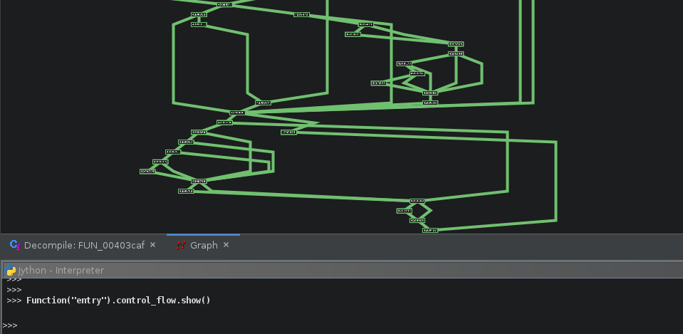
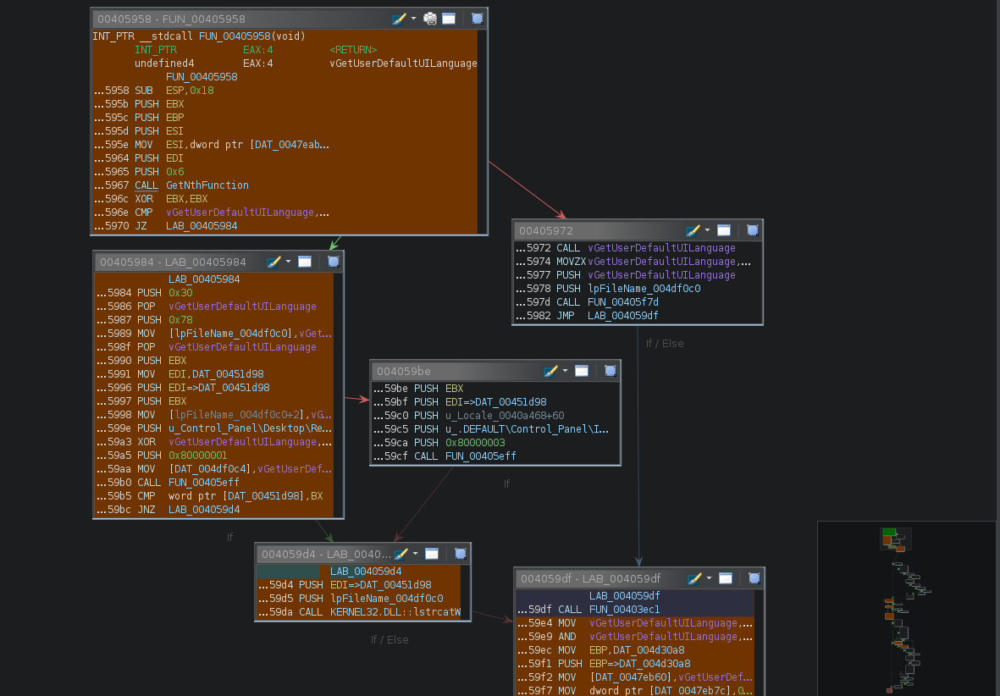

# ghidralib


This library is an attempt to provide a Pythonic standard library for Ghidra.

The main goal is to make writing quick&dirty scripts actually quick, and not that dirty.

## Installation

Just copy the [ghidralib.py](https://github.com/msm-code/ghidralib/blob/master/ghidralib.py) file to your ghidra_scripts directory.
Later just `from ghidralib import *`.

## Usage

Before you read the [documentation](https://msm-code.github.io/ghidralib/), you
can check these few examples of a basic ghidralib usage:

1. Get all function instructions (similarly for basic blocks, low and high pcode, calls and xrefs):

```python
print(Function("main").instructions)
```

<details>
  <summary>For comparison, plain Ghidra equivalent:</summary>

  ```python
  function_manager = currentProgram.getFunctionManager()
  symbol_table = currentProgram.getSymbolTable()
  main = list(symbol_table.getSymbols('main'))[0].getAddress()
  function = function_manager.getFunctionAt(main)
  instructions = currentProgram.getListing().getInstructions(function.getBody(), True)
  print(list(instructions))
  ```
</details>

2. You have a structure `uint8_t *data; uint32_t len;` at 0x1000 and you want to read it:

```python
pos, len_bytes = get_u32(0x10000), get_u32(0x10000 + 4)
print(get_bytes(pos, len_bytes))
```

<details>
  <summary>For comparison, plain Ghidra equivalent:</summary>

  ```python
  start_address = toAddr(0x10000)
  pos = currentProgram.getMemory().getInt(start_address)
  len_bytes = currentProgram.getMemory().getInt(start_address.add(4))
  data = getBytes(toAddr(pos), len_bytes)
  print(" ".join(chr(c % 256) for byte in data))  # signed bytes <3
  ```
</details>

3. Process all calls to a string deobfuscation function and get the parameters:

```python
for call in Function("MyCustomCrypto").calls:
    ctx = call.emulate()
    key, data = ctx["eax"], ctx["edx"]
    datalen = get_u32(data - 4)
    print(call.address, decode(get_bytes(data, datalen)))
```


<details>
  <summary>For comparison, plain Ghidra equivalent:</summary>

  Just joking! Too long to fit in this README.
</details>

4. Tons more QoL features:

```python
DataType("_NT_TIB")  # Get a datatype by name
DataType.from_c("typedef void* HINTERNET;")  # Quickly parse structs and typedefs

func = Function("main")  # Work at various abstract levels
print(function.instructions)  # Get instructions...
print(function.basicblocks)  # Get ..basic blocks...
print(function.pcode)  # ...low pcode...
print(function.high_pcode)  # ...high pcode...
print(function.decompile())  # ...or decompile a whole function

for xref in Symbol("PTR_GetProcAddress").xrefs_to:
  Instruction(xref.from_address).highlight()  # highlight symbol xrefs
```

5. There are also some flashy (but not necessarily useful) features that might
grab your attention.

Get the control flow graph of the main function, and display it:

```python
Function("main").control_flow.show()
```



Find the shortest path from source to target in the program control flow graph.
If it exists, highlight all basic blocks along the way.

```python
source, target = BasicBlock("entry"), BasicBlock(0x00405073)
path = Program.control_flow().bfs(source)
while path.get(target):
    target.highlight()
    target = path[target]
```



6. Thanks to type hints, scripting gets *much* easier if your IDE supports that.

Finally, ghidralib doesn't lock you in - you can always retreat to familiar Ghidra types
- they are always just there, in the `.raw` property. For example `instruction.raw`
is a Ghidra Instruction object, similarly `function.raw` is a Ghidra Function.
So you can do the routine stuff in ghidralib, and fall back to Java if something
is not implemented - like in the [SwitchOverride](./examples/SwitchOverride.py) example.

## Learn more

**Check out the [documentation](https://msm-code.github.io/ghidralib/)**, especially the
[getting started](https://msm-code.github.io/ghidralib/getting_started.html) page.

If you prefer to learn by example, tou can also browse the [examples](./examples/) directory.

A fair warning: ghidralib is still actively developed and the API may change
slightly in the future. But this doesn't matter for your one-off scripts, does it?

## Contributing

A bit too early to ask for contributions, but PRs are very welcome.
Ghidra API sufrace is huge and I covered just a small part of it (that I use most often).
Feel free to open PRs to add things you are missing.

You can also just report issues. Feature request are also accepted,
since I'm trying to cover common use-cases.

*Dragon icon at the top created by cube29, flaticon*
